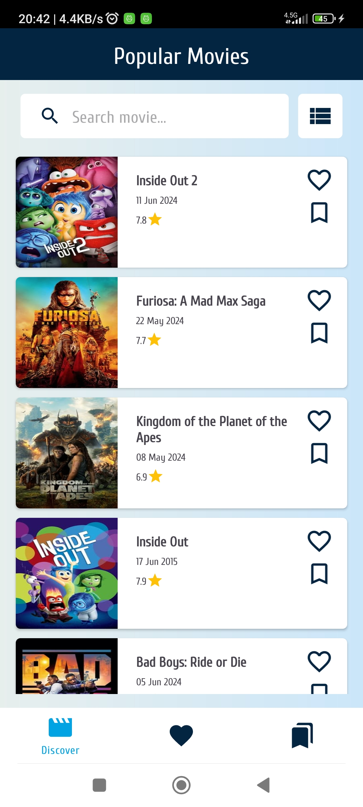
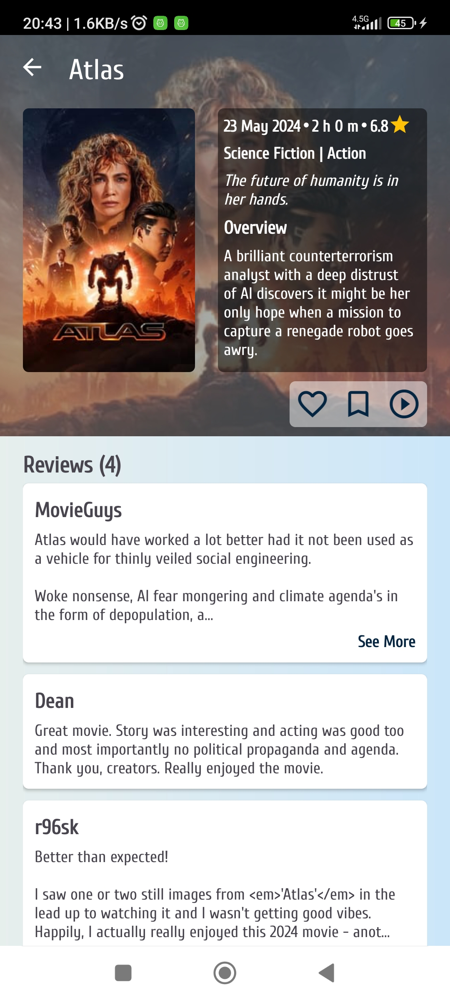

# MovieShelf

MovieShelf is an Android app that lets users explore and manage their favorite movies. This app offers features like movie search, favorite list management, and watchlist management to provide a complete movie exploration experience.

## Features

- **Popular Movies**: Browse the most popular movies.
- **Search Movies**: Look for movies by their title.
- **Movie Details**: See detailed information about a selected movie, including its ratings, release date, overview, and more.
- **Favorite Movies**: Add or remove movies from your favorites list.
- **Watchlist**: Add or remove movies from your watchlist.
- **Offline Access**: Save movie data for offline access.

## Presentation

[YouTube Video](https://youtu.be/cBgmoN0xtjA)

## Screenshots

### Grid View


### List View



### Empty States


### Favorites


### Watch List


### Movie Details



### Search Results


## Installation

1. Clone the repository:
    ```sh
    git clone https://github.com/eemreguven/MovieShelf.git
    ```

2. Open the project in Android Studio.

3. Build and run the project on an emulator or physical device.

## Usage

- **Browsing Movies**: Open the app to see a list of popular movies.
- **Searching**: Use the search bar to find movies by title.
- **Adding to Favorites**: Tap the favorite icon on a movie to add it to your favorites list.
- **Adding to Watchlist**: Tap the watchlist icon to add a movie to your watchlist.
- **Viewing Details**: Tap on a movie to see detailed information about it.

## Architecture

The app follows the MVVM (Model-View-ViewModel) architecture pattern. This helps to keep the code organized and easier to maintain.

### Technologies Used

- **Kotlin**: Main programming language.
- **Jetpack Components**: ViewModel, LiveData, Paging, Navigation.
- **Dagger Hilt**: Dependency Injection.
- **Retrofit**: HTTP client for API calls.
- **Glide**: Image loading and caching library.
- **Room**: Database for offline storage.

## API

This project uses the [The Movie Database (TMDB) API](https://www.themoviedb.org/documentation/api) to get movie data. You will need to get an API key from TMDB and add it to your project.

## Contact

- **Author**: Emre Güven
- **GitHub**: [eemreguven](https://github.com/eemreguven)
